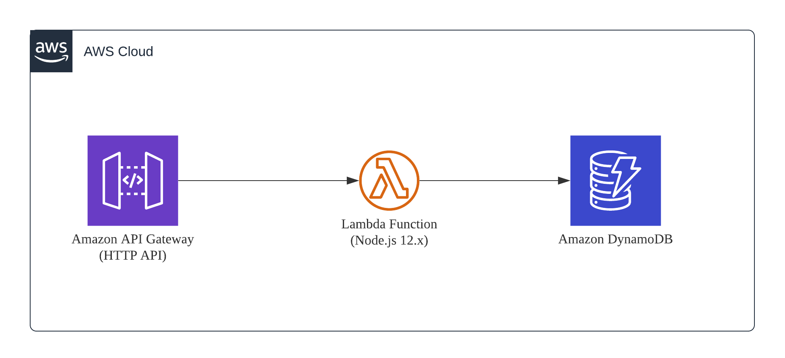

# AWS Serverless HTTP API Boilerplate
Node.js based RESTful HTTP API boilerplate that is built on AWS SAM. This boilerplate serves as a "Getting Started" template for getting your AWS Serverless APIs ready for production usage with native AWS serverless services.



## Key Features
* Enhanced logging with contextual information in standardized JSON format
* Measure and log every function's performance using Node.js's native `perf_hooks`
* Enabled AWS X-Ray for AWS Services and 3rd Party HTTPS Modules (npm's `request`)
* Using CloudWatch's Embedded Metrics Format (EMF) to publish custom metrics - individual function processing time, count of detailed HTTP status codes
* Custom AWS helper functions deployed using Lambda Layers
* Sample Create / Read / Update/ Delete HTTP API to Amazon DynamoDB
* Sample Events and Environment Variable files to facilitate local testing

## Technology Stack

### AWS
| Service                    | Description                                                                      |
|----------------------------|----------------------------------------------------------------------------------|
| Amazon API Gateway         | Using HTTP APIs to expose Lambda as a REST API.                                  |
| AWS Lambda                 | Microservice logic                                                               |
| Amazon Cloudwatch Logs     | Storage of logs                                                                  |
| Amazon Cloudwatch Insights | Retrieve logs for debugging/troubleshooting. Similar to how you would use Kibana |
| Amazon Cloudwatch Metrics  | View metrics pertaining to your APIs in a graphical manner                       |
| AWS X-Ray                  | Tracing for Lambda and related AWS services                                      |

### Node.js / npm Libraries
| Library                | Description                                        |
|------------------------|----------------------------------------------------|
| aws-embedded-metrics   | To leverage on Cloudwatch's Embedded Metric Format |
| aws-xray-sdk           | To leverage on AWS X-Ray                           |
| request                | Invoke external APIs                               |
| request-promise-native | Wrapper to leverage request with promise           |
| uuid                   | Generate RFC4122 UUIDs (e.g. coorelation id)       |
| winston                | Logging library                                    |

## Pre-requisites
* Node.js 12.x
* AWS CLI v1.16.110 and above
* AWS SAM CLI v0.52.0 and above
* Docker installed (For local testing)

## Deployment Steps
```
# Step 1: Clone Repository
git clone https://github.com/leroychan/aws-serverless-http-api-boilerplate

# Step 2: Change directory
cd aws-serverless-http-api-boilerplate

# Step 3: Install libraries
cd layer-dependencies/nodejs
npm install

# Step 4: Get back to project root directory
cd ..

# Step 5: Build
sam build

# Step 6: Deploy
sam deploy --guided

# Step 7: Once the deployment is successful, you should see an output with the RESTful API endpoint
```

## Sample APIs
| Endpoint         | Method | Description                                                                                                                 |
|------------------|--------|-----------------------------------------------------------------------------------------------------------------------------|
| /helloworld      | POST   | Creates a record in DynamoDB Table based on JSON payload. `id` is required in the JSON payload. Accepts any key-value pair. |
| /helloworld      | GET    | Returns all the records in DynamoDB Table using the `Scan` operation                                                        |
| /helloworld/{id} | GET    | Returns an individual record in DynamoDB Table based on the `id` specified                                                  |
| /helloworld/{id} | PUT    | Updates an individual record with the new JSON payload in DynamoDB Table                                                    |
| /helloworld/{id} | DELETE | Deletes an individual record in DynamoDB Table                                                                              |

### Sample JSON Payload for `POST /helloworld`
```
{
	"id": "1",
	"name": "John Doe",
	"age": "17"
}
```

## View Logs
1. Login to your AWS console
2. Go to Cloudwatch > Logs > Log Groups
2. Obtain `correlationId` by checking Cloudwatch's Log Groups. In production scenario, `correlationId` might be return as part of your API to your end user.
3. Go to Cloudwatch > Logs > Insights
4.. Use the following query to fetch logs 
```
fields @timestamp, correlationId, functionName, apiContext.rawPath, apiContext.requestContext.http.method, logType, @message
| filter correlationId = 'your-correlation-id-here'
| sort @timestamp desc
| limit 20
```

## Local Development
### View Logs from your console/terminal
`sam logs -n HelloWorldApi --stack-name REPLACE-WITH-STACK-NAME --region ap-southeast-1 -t`

### Invoke lambda locally
`sam local invoke "HelloWorldApi" -e events/apigw.json --env-vars env.json --region ap-southeast-1`
> Region is important, if region is omitted, typically it will throw a `Resource Not Found` error

## License
This boilerplate is licensed under the MIT-0 License. See the [LICENSE](LICENSE.md) file.